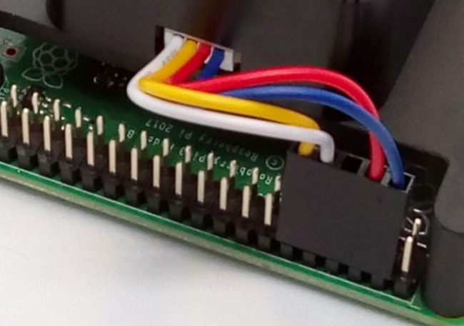

# OKdo DTOF LD06 라이다 센서 HAT 사용법  

**라즈베리파이**에서 **LD06 라이다 센서 HAT** 2D 시각화 예제 프로그램 구동을 위한 설치 가이드입니다.  

## 참고 자료

[엘레파츠- 라이다 센서 제품 페이지](https://www.eleparts.co.kr/EPXXCNHL)  

[(네이버 블로그 포스팅) DTOF LD06 라이다 센서 데이터 2D 시각화 예제 설치&실행하기](https://blog.naver.com/elepartsblog/222596017902)  

[설치 가이드(OKdo) pdf 파일](https://github.com/eleparts/sdk_ld06_raspberry_ros/blob/main/doc/OKdo-Lidar-get-started-update.pdf)  

**본 예제는 설치 스크립트의 중단점이 제거되어 있습니다.**

## 설치 명령어  

### OKdo 설치 가이드 파일의 간략 설명입니다. 자세한 부분은 네이버 블로그를 참고해 주세요  

```bash
# 설치 파일&스크립트 clone로 다운로드
git clone https://github.com/eleparts/sdk_ld06_raspberry_ros.git

# 해당 디렉토리로 이동하여 설치 스크립트 실행 (2시간 15분가량 소요)
cd sdk_ld06_raspberry_ros
./lidar_ros_setup.sh
```  
  
스크립트 실행 후 설치에 약 **2시간 15분 정도의 시간이 소요**됩니다.  
  
> 설치가 완료되면 재부팅 해 주고 설치가 되었는지 확인해 줍니다.  
  
```bash  
# 재부팅  
sudo reboot  
  
# 설치 성공 여부 확인  
roscore  
```  
  
> [Raspberry Pi Configuration]을 열고 Serial Port를 Enable 해 준 뒤 라이다 센서를 연결해 줍니다.  
>  
>   
  
> 라이다 센서 연결 시 위치 및 방향에 주의해 줍니다.  
>  
>   
  
```bash  
# 추가 설치 스크립트 실행  
cd sdk_ld06_raspberry_ros  
./lidar_driver_setup.sh  
  
# 재부팅  
sudo reboot  
```  
  
## 설치 확인 및 프로그램 구동  
  
두개의 터미널 창에서 각각 실행해 줍니다.  
  
```bash  
# 실행 후 종료하지 않고 켜 둡니다  
roslaunch ldlidar ld06.launch  
```  
  
```bash  
# 새 터미널 창을 열어 rviz를 실행합니다  
rosrun rviz rviz  
```  

> [File] -> [Open Config] 창에서 **rviz**디렉토리의 ldlidar.rviz 파일을 열어 줍니다.  
>  
>  
  
## 동작 확인
  
>  
